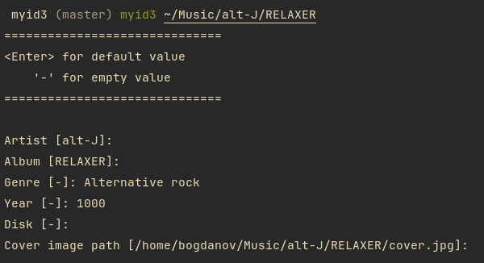

# MYID3

A small and simple GO script for bulk editing MP3 [ID3][] tags

[ID3]: https://en.wikipedia.org/wiki/ID3



## Usage

MYID3 depends on `ffmpeg` and `ffprobe`, make sure they are in your `$PATH`

```
myid3 <path>
```

**Song file name format**

```
[number] <title>.<format>
001 Song Title.mp3
002 Song title ___ with slash.mp3
Title.opus
```

**If you specify a directory**

The name of this dir is considered as a default
album name and parenting dir is considered as a default artist name

MYID3 will also try to search for `cover.{jpg,png,webp}` file inside the album
directory and set it as default album cover image

**If you specify a single song file**

Specifing a single file will only set default song title and song number based
on the file name

**NOTE**

- All song files will eventually be converted to `.mp3` files (you can customize
this by changing the source code)

- `___` in all filenames will be replaced with `/`
(e.g. `001 INTRO ___ DINOSAUR.mp3` becomes `001 INTRO / DINOSAUR.mp3`)

**Example tree**:

```
~/Music/
| My Lovely Artist/
| | His Cool Album/
| | | 001 First Song.mp3
| | | 002 Second Song.mp3
| | Another Album/
| | | 001 Song.mp3
|
| WHITEY/
| | CANNED LAUGHTER/
| | | 001 INTRO ___ DINOSAUR.mp3
| | | 002 TIME'S UP.mp3
| | GREAT SHAKES/
```

**Example command**:

```sh
myid3 ~/Music/Radiohead/Kid A/
# Artist - "Radiohead"
# Album - "Kid A"
```

## License

Distributed as public domain

Do whatever you want
